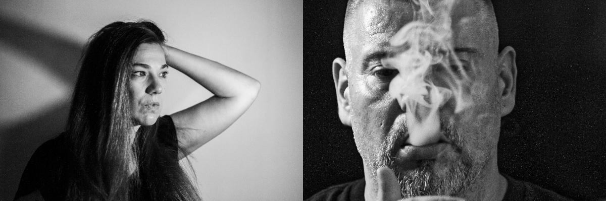

# geometrija.github.io

***Geometrija*** is a project dedicated to the representation and exploration of the art of geometric abstraction. Its primary goal is the research and chronicle of creative work in this field by Serbian and regional artists within the global, international context of contemporary visual arts. The project is led by painter **Dr Miona Marta Marković** (MA in Visual Arts, Accademia di Belle Arti, Naples; PhD in Art History, Università Sapienza, Rome) as author and curator, and Cognitive and Data Scientist and visual art collector **Dr Goran S. Milovanović** (PhD in Psychology, University of Belgrade) as producer.

The design for the ***Geometrija*** project was provided by Serbian painter **Dr Mila Gvardiol**.

The ***Geometrija*** project is privately funded and non-profit.

